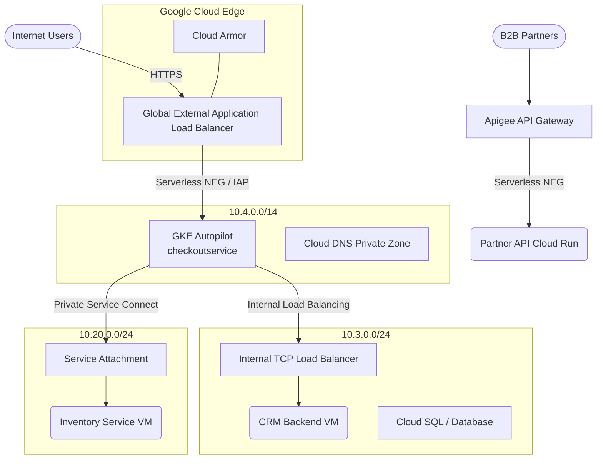

# Comprehensive GCP Networking Reference (Networking View)

The primary goal of this demonstration project is to showcase maximum diversity in **Google Cloud Platform (GCP)** networking topologies. Modern software architectures demand secure, resilient, and performant networks. 

This document breaks down exactly how different microservice components communicate, the networking technologies utilized, and why specific patterns were chosen. 

---

## 1. Complete Architecture Network Map

Below is a detailed visual representation of the network flows, VPC boundaries, and Edge proxies. It outlines how components are completely segregated to eliminate a single massive point of failure while strictly orchestrating data across subnets.

 

---

## 2. Catalog of Networking Features Used

This catalog defines the fundamental building blocks of GCP networking mapped directly to our practical implementation. Use this as a reference guide to understand the "Why" and "How" of GCP Cloud Networking.

### 2.1 Virtual Private Cloud (VPC)
**What is it?**  
A Virtual Private Cloud (VPC) provides networking functionality to Compute Engine virtual machine (VM) instances, GKE clusters, and serverless environments. It provides global, scalable, and flexible networking for your cloud-based resources and services.  
👉 [Read the official documentation](https://cloud.google.com/vpc/docs/vpc)

**How we use it:**  
We deliberately split the system into multiple isolated VPCs (`online-boutique-vpc`, `crm-vpc`, and `inventory-vpc`) instead of a single giant network. This contains the "blast radius" in the event of a security breach. If the Inventory subnet is compromised, attackers cannot physically route packets into the CRM database.

### 2.2 Global External Application Load Balancer
**What is it?**  
A globally distributed HTTP(S) proxy that balances traffic across multiple backend instances across different regions. It terminates SSL connections at the edge nearest to your users, greatly reducing latency.  
👉 [Read the official documentation](https://cloud.google.com/load-balancing/docs/https)

**How we use it:**  
All public customer traffic ingress routes exclusively through this Load Balancer. It terminates TLS globally and forwards traffic directly to internal GKE nodes via Serverless NEGs (Network Endpoint Groups).

### 2.3 Cloud Armor (Web Application Firewall)
**What is it?**  
Google Cloud Armor delivers enterprise-grade DDoS protection and WAF (Web Application Firewall) to protect web applications or services from internet threats.  
👉 [Read the official documentation](https://cloud.google.com/armor/docs/cloud-armor-overview)

**How we use it:**  
We attach a Cloud Armor security policy directly to the External Application Load Balancer to perform Layer 7 filtering (e.g., blocking malicious IPs, mitigating SQL injection, and evaluating geographic restrictions) before traffic even arrives at the underlying Kubernetes clusters.

### 2.4 Private Service Connect (PSC)
**What is it?**  
Private Service Connect lets consumers access managed services privately from inside their VPC network. It completely eliminates the need for complex VPC Peering networks spanning dozens of overlapping IP address spaces. Consumers simply target a single internal IP addresses mapped natively into their subnet.  
👉 [Read the official documentation](https://cloud.google.com/vpc/docs/private-service-connect)

**How we use it:**  
- **Component & Target:** `checkoutservice` (GKE) $\rightarrow$ Inventory Service (GCP VM)
- **Rationale**: The `inventory-vpc` is strictly isolated without public ingress. The consumer (`online-boutique-vpc`) accesses the inventory API using a single reserved IP address configured as a PSC endpoint. This creates maximum security via Producer/Consumer separation. Unlike VPC Peering, which exposes entire subnets unconditionally, PSC explicitly exposes a single target API.

### 2.5 Serverless VPC Access & Direct VPC Egress
**What is it?**  
Native integrations to allow Serverless resources (Cloud Run, Cloud Functions) to dispatch outbound requests into internal, private VPC networks that have no external IPs.  
- **Serverless VPC Access:** Routes traffic through a dedicated VM "Connector" bridge deployed inside the target network. [Documentation](https://cloud.google.com/vpc/docs/serverless-vpc-access)
- **Direct VPC Egress:** Natively attaches the serverless container onto a dedicated subnet, completely bypassing the bottleneck of a Connector VM. [Documentation](https://cloud.google.com/run/docs/configuring/vpc-direct-vpc)

**How we use it:**  
- **Direct VPC Egress**: The Warehouse Service uses this modern standard to hit internal endpoints over Google's backbone efficiently.
- **VPC Access Connector**: The Accounting Service demonstrates the legacy connector method connecting into the CRM network, useful for comparison in high-scale throughput tests to demonstrate the latency impacts of connector cold starts.

### 2.6 Internal TCP/UDP Load Balancing (ILB)
**What is it?**  
Enables you to run and scale your services behind a private load balancing IP address that is accessible only to your internal instances.  
👉 [Read the official documentation](https://cloud.google.com/load-balancing/docs/internal)

**How we use it:**  
Traffic to the legacy CRM mono-repo passes through an unmanaged instance group concealed behind a regional Internal Load Balancer serving on `10.3.0.xxx:8080`. It distributes stateless logic transparently across legacy VMs while exposing a highly available internal facade. 

### 2.7 Cloud DNS (Private Zones)
**What is it?**  
Cloud DNS is a scalable, reliable, and managed authoritative Domain Name System (DNS) service. A private zone holds records for internal VMs and load balancers, restricting visibility to strictly authorized VPC networks.  
👉 [Read the official documentation](https://cloud.google.com/dns/docs/zones)

**How we use it:**  
Instead of hardcoding raw IPs (`10.x.x.x`), we created a `internal.boutique.local` private managed zone. We explicitly bound this zone's visibility to all three of our VPC networks, meaning services in `online-boutique-vpc` can automatically resolve the `inventory` PSC endpoint simply by hitting `inventory.internal.boutique.local`.

### 2.8 High Availability (HA) Cloud VPN
**What is it?**  
HA VPN natively encrypts traffic between Google Cloud and on-premises (or other cloud) networks using an IPsec VPN connection over the public internet, providing an industry-leading 99.99% SLA.  
👉 [Read the official documentation](https://cloud.google.com/network-connectivity/docs/vpn/concepts/overview)

**How we use it:**  
This connects the boutique GKE clusters network with the `Furniture Service` dedicated backend VPC. It simulates connecting a modern cloud footprint back to a legacy on-prem datacenter via BGP dynamic routing, handling routing failovers transparently.

### 2.9 Private Google Access (PGA)
**What is it?**  
Allows VMs without public IP addresses to reach Google API endpoints securely.  
👉 [Read the official documentation](https://cloud.google.com/vpc/docs/private-google-access)

**How we use it:**  
Our deeply private GKE nodes and Cloud Run containers interact with Cloud Pub/Sub and BigQuery. Instead of spinning up NAT Gateways (resulting in egress costs and internet routing), PGA transparently intercepts calls to `*.googleapis.com` and securely loops internet-bound packets internally through Google's core backbone without ever touching the public web.

### 2.10 VPC Service Controls (VPC SC)
**What is it?**  
Mitigates the risk of data exfiltration from Google Cloud services such as Cloud Storage and BigQuery. It defines a hardened security perimeter around the APIs themselves.  
👉 [Read the official documentation](https://cloud.google.com/vpc-service-controls/docs/overview)

**How we use it:**  
The Data Warehouse (BigQuery) and Event Broker (Cloud Pub/Sub) are ring-fenced. If a developer's service key is stolen or leaked on GitHub, malicious actors on the public internet cannot execute queries because the perimeter requires the traffic origination to physically come from inside the authorized VPC namespaces.

---

## 3. Summary of Core Principles
1. **Never expose internal APIs to the public internet** unless strictly using an enterprise gateway like Apigee.
2. **Prefer Private Service Connect** over standard VPC peering when integrating third parties or distinct bounded contexts to minimize lateral movement vulnerabilities.
3. **Use Direct VPC Egress** for modern Serverless systems instead of Serverless VPC Access Connectors which introduce scaling constraints. 
4. **Leverage Cloud DNS** across networks for resilient internal service discovery and to prevent IP hardcoding.
