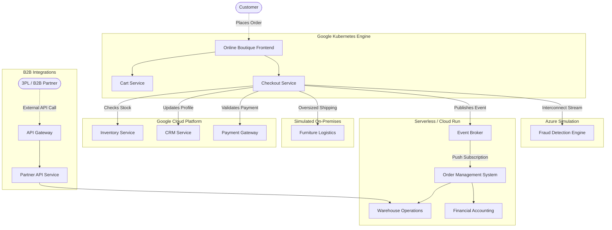

# Multicloud E-Commerce Architecture: Business View

## 1. Executive Summary

"Online Boutique" is a rapidly growing global e-commerce enterprise. After years of running a monolithic architecture, recent corporate acquisitions and a drive toward modernization have evolved the IT landscape into a distributed, multi-cloud microservices ecosystem. 

The core storefront operates natively on Google Cloud. However, the business logic required to fulfill a customer order—checking stock, updating customer records, processing finances, and evaluating fraud risk—is spread across discrete backend systems. Some systems run on Google Cloud Platform (GCP) virtual machines, some have been modernized to GCP serverless architectures, and following a recent merger, the company's proprietary fraud detection engine resides in Microsoft Azure.

**The primary business objective** is to execute a seamless, real-time checkout process that orchestrates transactions across all these heterogeneous systems, leveraging modern enterprise patterns for scale.

---

## 2. Logical Architecture Diagram

The diagram below maps how business components interact asynchronously and synchronously without exposing raw database access directly to the internet.

 

---

## 3. Logical Components Breakdown

This section describes the business capabilities of each major IT system block within the enterprise.

### 3.1 Core E-Commerce Front
*   **Checkout Service**: The central orchestrator. When a user places an order on the storefront, this service initiates the fulfillment flow by rapidly broadcasting the confirmed order to all downstream operational systems simultaneously without delaying the customer's receipt.

### 3.2 Enterprise Resource Planning (ERP)
These systems represent traditional enterprise workloads safeguarding the company's core data.
*   **Customer Relationship Management (CRM) Service**: Maintains customer profiles, loyalty tiers, and account standing.
*   **Inventory Service**: The master ledger for standard product stock levels.
*   **Furniture Service**: A specialized inventory system handling bulky, freight items with custom shipping rules.

### 3.3 Backend Operations
Newly developed workflows utilizing dynamic, modernized infrastructure.
*   **Order Management System (OrderManagement)**: Assumes responsibility for the order's lifecycle the moment a checkout is confirmed. It orchestrates fulfillment routing, shipping updates, and returns via internal event-driven architectures.
*   **Warehouse Service**: Handles complex shipping logistics, parcel dispatching, and physical tracking.
*   **Accounting Service**: Records financial ledgers, tax calculations, and revenue recognition for every sale.

### 3.4 B2B Partner Integration
External collaborations utilizing secure, public-facing developer APIs.
*   **API Management (Apigee)**: The enterprise-grade public gateway exposing the company's B2B APIs to the outside world. It manages third-party developer portals, API key lifecycles, monetization, and strict quotas for external corporate partners.
*   **Partner API Service**: Sitting securely behind Apigee, this service allows third-party logistics (3PL) providers to push shipping statuses natively, and permits bulk B2B resellers to programmatically retrieve active product catalogs.

### 3.5 Risk & Compliance
*   **Fraud Detection Engine**: A real-time risk analysis system remaining in Azure. It evaluates transaction metadata to compute risk scores, flag anomalous behavior, and prevent fraudulent orders before fulfillment.

### 3.6 Enterprise Data Intelligence
*   **Data Warehouse**: The primary enterprise data lake. It continuously aggregates telemetry, financial ledgers, logistics data, and user events from across the entire microservice ecosystem to drive executive business intelligence (BI) dashboards, generate compliance reports, and train predictive machine learning models.

### 3.7 AI Agentic Customer Service
Deployment of the Google ADK and Vertex AI for intelligent query resolution.
*   **Frontend Concierge**: An intelligent, user-facing Chat Widget integrated into the CRM Dashboard that provides conversational context natively.
*   **Back-Office Investigator**: A highly constrained internal worker agent, isolated from the user, that securely executes real-time semantic database lookups via Model Context Protocol (MCP) without compromising raw data boundaries.
