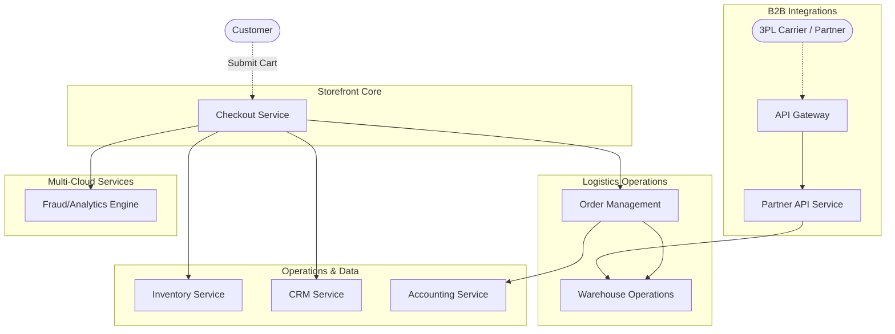

# Business Domains

The Multi-Cloud E-Commerce Demo maps to distinct logic modules that manage specific functions within an e-commerce lifecycle. This section highlights the roles and responsibilities of each discrete service domain without examining networking specifics or infrastructural operations.

## 1. Domain Overview

The system consists of core storefront orchestrators, centralized operations systems, risk-analysis computation, and asynchronous fulfillment backends.

 

---

## 2. Logical Components Breakdown

### 2.1 Storefront & Presentation
*   **Checkout Service**: The primary entry point for concluding an online transaction. Upon cart submission, this orchestrator coordinates multiple checks—including stock validation against the inventory system and risk analysis against the fraud engine—before finalizing the payment procedure and triggering fulfillment.

### 2.2 Core Operations
*   **Inventory Service**: Manages physical stock calculations and availability logic. It locks stock items temporarily during the synchronous checkout phase to prevent overselling and permanently adjusts ledgers whenever shipments originate.
*   **Customer Relationship Management (CRM) Service**: Acts as the centralized source of truth for customer identities. It processes account lookups, enforces returning loyalty tier conditions, and manages personal data records required for billing.
*   **Accounting Service**: Evaluates and records the completed transactions into a centralized ledger natively for tax recognition, historical analytics, and revenue balancing protocols. It pairs transaction IDs with the appropriate internal customer records.

### 2.3 Fulfillment & Logistics
*   **Order Management System (OrderManagement)**: An internal event listener responsible strictly for order orchestration after the transaction successfully completes. It ingests order messages directly off an asynchronous bus and triggers downstream processes across multiple warehouses or accounting systems.
*   **Warehouse Operations**: Handles physical shipping dispatch calculations. It provides shipping latency windows natively to the storefront and triggers final stock reductions inside the core Inventory datastore.

### 2.4 Partner Integrations
*   **API Management (Apigee)**: A managed gateway platform responsible solely for evaluating specific quotas, rate limits, and API signatures for external third-party traffic entering the corporate network.
*   **Partner API Service**: A specialized internal endpoint proxying authenticated data inward, allowing Third-Party Logistics (3PL) carriers to programmatically transmit localized delivery statuses or sync product catalog IDs directly using securely exposed internal endpoints.

### 2.5 Multi-Cloud Services
*   **Fraud Detection / Analytics Engine**: An external service (hosted natively on Microsoft Azure) that evaluates incoming HTTP transaction metadata against heuristic engines to generate a boolean risk score instantly, actively attempting to decline suspicious payloads before they affect physical fulfillment.
