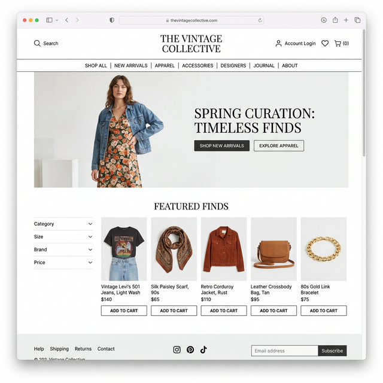
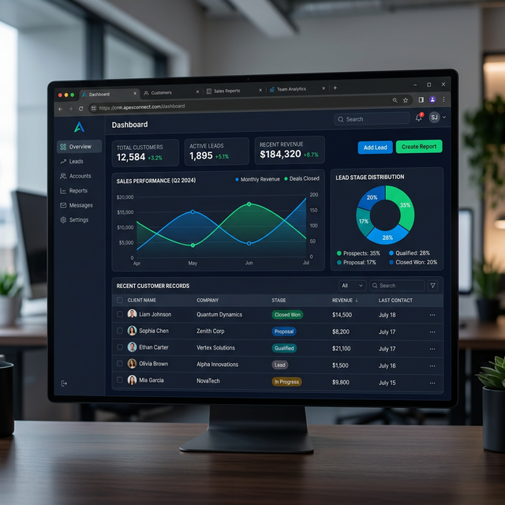
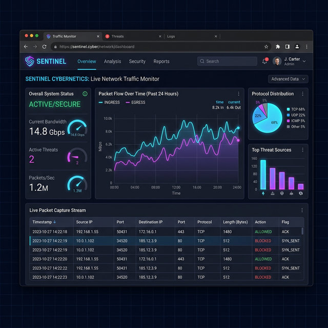

# 🌩️ Multi-Cloud E-Commerce Demo

Welcome to the Multi-Cloud E-Commerce Demo developer documentation. This project provides a reference architecture for a distributed microservices system across multiple environments, demonstrating the practical application of Google Cloud networking, compute, and security products alongside multi-cloud integration.

---

## 🚀 Live Environment Hub
The entire platform is actively deployed and running natively on Google Cloud. You can directly interact with the live applications below, or jump straight into the cloud architecture using the [**Google Cloud Console**](https://console.cloud.google.com/welcome?project=gcp-ecommerce-demo).

  <!-- Online Boutique -->
  <a href="http://www.gcp-ecommerce-demo.com" target="_blank" style="text-decoration: none; color: inherit; border: 1px solid var(--md-default-fg-color--lightest); border-radius: 8px; overflow: hidden; display: flex; flex-direction: column; transition: transform 0.2s, box-shadow 0.2s;" onmouseover="this.style.transform='translateY(-4px)'; this.style.boxShadow='0 8px 24px rgba(0,0,0,0.1)';" onmouseout="this.style.transform='translateY(0)'; this.style.boxShadow='none';">
    
    

      <h3 style="margin-top: 0; margin-bottom: 0.5rem; font-size: 1.15rem;">🛍️ Online Boutique</h3>
      
The customer-facing frontend. Natively leverages Serverless Cloud Run and GKE under a Global Load Balancer.

    

  </a>

  <!-- CRM Dashboard -->
  <a href="http://crm.gcp-ecommerce-demo.com" target="_blank" style="text-decoration: none; color: inherit; border: 1px solid var(--md-default-fg-color--lightest); border-radius: 8px; overflow: hidden; display: flex; flex-direction: column; transition: transform 0.2s, box-shadow 0.2s;" onmouseover="this.style.transform='translateY(-4px)'; this.style.boxShadow='0 8px 24px rgba(0,0,0,0.1)';" onmouseout="this.style.transform='translateY(0)'; this.style.boxShadow='none';">
    
    

      <h3 style="margin-top: 0; margin-bottom: 0.5rem; font-size: 1.15rem;">💼 CRM Dashboard</h3>
      
Secure internal portal for managing orders over HTTPS. Built with Node.js and integrates Vertex AI Agents.

    

  </a>

  <!-- Traffic Collector -->
  <a href="http://traffic.gcp-ecommerce-demo.com" target="_blank" style="text-decoration: none; color: inherit; border: 1px solid var(--md-default-fg-color--lightest); border-radius: 8px; overflow: hidden; display: flex; flex-direction: column; transition: transform 0.2s, box-shadow 0.2s;" onmouseover="this.style.transform='translateY(-4px)'; this.style.boxShadow='0 8px 24px rgba(0,0,0,0.1)';" onmouseout="this.style.transform='translateY(0)'; this.style.boxShadow='none';">
    
    

      <h3 style="margin-top: 0; margin-bottom: 0.5rem; font-size: 1.15rem;">🛡️ Traffic Collector</h3>
      
Out-of-band Packet Mirroring dashboard tracking live security signatures asynchronously.

    

  </a>

---

## 🎯 Educational Focus

This documentation is designed for Software Engineers (SWEs), Network Engineers, and Product Managers (PMs) to understand and evaluate advanced system design and network perimeters in practice. 

By exploring this architecture, you will learn how to:

- **Apply Zero-Trust Networking**: Understand the specific use cases for [Private Service Connect (PSC)](https://console.cloud.google.com/net-services/psc/list/consumers?project=gcp-ecommerce-demo) and [Internal Load Balancing (ILB)](https://console.cloud.google.com/net-services/loadbalancing/list/loadBalancers?project=gcp-ecommerce-demo) to enforce strict boundaries.
- **Connect Serverless Workloads Securely**: Compare [Direct VPC Egress](https://console.cloud.google.com/run?project=gcp-ecommerce-demo) with [Serverless Connectors](https://console.cloud.google.com/networking/connectors/list?project=gcp-ecommerce-demo).
- **Implement Multi-Cloud Integrations**: Route secure communication across boundaries utilizing [Dedicated Interconnects](https://console.cloud.google.com/hybrid/interconnects?project=gcp-ecommerce-demo) or [HA VPNs](https://console.cloud.google.com/hybrid/vpn/list?project=gcp-ecommerce-demo).
- **Govern B2B External Access**: Use [Apigee API Management](https://console.cloud.google.com/apigee?project=gcp-ecommerce-demo) to precisely protect internal workloads.
- **Enable Event-Driven Operations**: Utilize [Google Cloud Pub/Sub](https://console.cloud.google.com/cloudpubsub/topic/list?project=gcp-ecommerce-demo) and [BigQuery](https://console.cloud.google.com/bigquery?project=gcp-ecommerce-demo) for data pipelines.
- **Integrate AI & Intelligence**: Build workflows utilizing [Vertex AI Agent Engine](https://console.cloud.google.com/vertex-ai?project=gcp-ecommerce-demo) and modern language proxies.
- **Network Observability & Security**: Deploy Out-of-Band (OOB) [Packet Mirroring](https://console.cloud.google.com/net-intelligence/packet-mirroring?project=gcp-ecommerce-demo) for real-time Deep Packet Inspection.

---

## 📚 Documentation Navigation

To systematically understand the system, explore the modules in the following order:

### 1. [Business Domains](business.md)
Understand what the application components do. Explores functional areas without delving into code.
[Explore Business Domains](business.md){ .md-button .md-button--primary }

### 2. [Technical Architecture](technical.md)
A breakdown of the APIs, data flows, and inter-service communication patterns.
[Explore Technical Architecture](technical.md){ .md-button }

### 3. [Cloud Networking](networking.md)
A detailed analysis of how traffic physically routes between isolated VPCs and services.
[Master Cloud Networking](networking.md){ .md-button }

### 4. [Infrastructure & DevOps](infrastructure.md)
A review of the multi-region deployment map and Terraform infrastructure-as-code structure.
[See Infrastructure Specs](infrastructure.md){ .md-button }

 
*Built with ♥️ using [`Material for MkDocs`](https://squidfunk.github.io/mkdocs-material/).*
