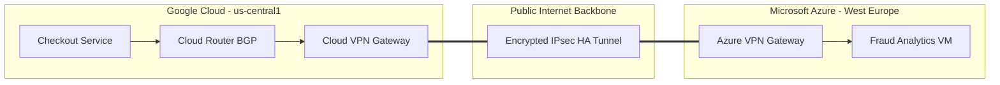

# Multi-Cloud Connectivity (VPN & BGP)

## What is Cross-Cloud / Hybrid Connectivity?
For high availability or multi-cloud topologies, networks physically extending outside Google Cloud boundaries (like to on-premises datacenters or Microsoft Azure) require resilient layer-3 mappings. This is typically achieved leveraging High Availability (HA) IPsec VPN tunnels, or direct Dedicated Interconnect circuits scaling globally and relying on Border Gateway Protocol (BGP) for dynamic routing.

## How It's Used in This Project
To analyze fraud risk across geographical operations realistically, this structure integrates an external specialized Node engine configured alongside an isolated Azure Virtual Machine framework.

An HA Cloud VPN dynamically links the `online-boutique-vpc` inside Google Cloud to the `fraud-vnet` hosted in Microsoft Azure. Legitimate internal traffic explicitly avoids hitting standard internet protocols, bridging completely private RFC-1918 allocations universally and securely.

### Architectural Diagram

