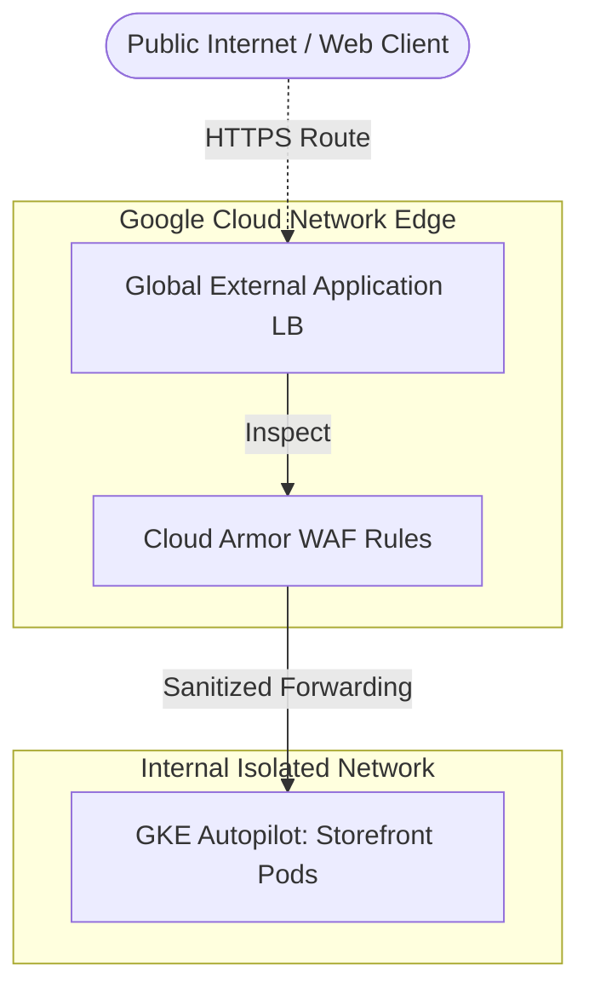

# External Load Balancer (Global Application)

## What is an External Load Balancer?
Google Cloud's Global External Application Load Balancer is a Layer 7 proxy designed to distribute HTTP and HTTPS traffic securely across multiple regional backends worldwide. Instead of routing users directly to a public IP on a single bare-metal machine, traffic is terminated physically at Google's network edge—minimizing user latency and offloading TLS encryption.

## How It's Used in This Project
In the E-Commerce Demo, public users only ever interact with the Global External Application Load Balancer natively. The load balancer protects the GKE ingress instances orchestrating the storefront operations by preventing direct internet exposure inherently.

We also optimally bind **Google Cloud Armor** policies onto this load balancer immediately proactively filtering out layer-7 attacks (like volumetric DDoS and malicious signatures securely) explicitly before the packet inherently reaches our application routing logic directly.

### Architectural Diagram

