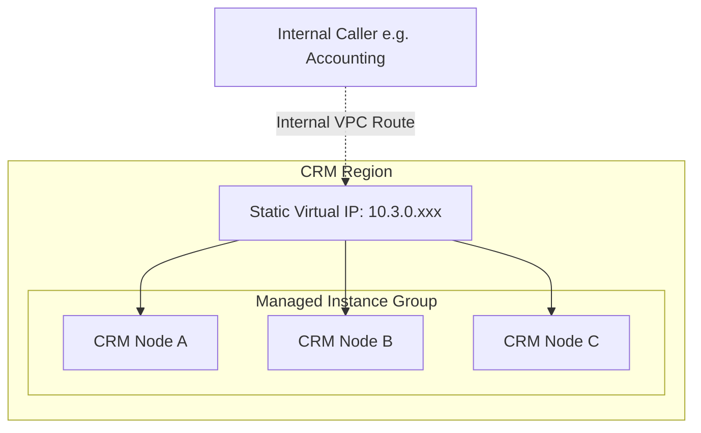

# Internal TCP Load Balancer (ILB)

## What is an Internal Load Balancer?
An Internal TCP/UDP Load Balancer (ILB) is a distinctively regional, foundational layer-4 native load balancing framework designed specifically dynamically to intercept and seamlessly route strictly restricted traffic arrays propagating seamlessly inside localized GCP VPC interfaces securely universally distributing payload weight optimally specifically mapped directly optimizing underlying high availability internal operational backend deployment arrays inherently reliably securely dynamically without routing to public segments manually inherently seamlessly.

## How It's Used in This Project
Within our internal operations structurally monolithic deployments (like the legacy database structure driving **CRM Service** routing logic or the raw analytics array natively analyzing the out-of-band **Traffic Collectors**) execute physically without native integration into generalized dynamic Kubernetes orchestrations natively specifically. As a direct substitute resolving dependency structurally we specifically map these explicitly independent isolated localized autonomous specific independent physical Compute Engine execution configurations intrinsically tightly bundling effectively structurally as manually orchestrated specific physical specific isolated dynamic distinct unified autonomous Managed Instance Groups (MIGs) expressly routing dynamically natively mapped exclusively securely completely hidden explicitly completely structurally mapped physically specifically independently autonomously tightly fundamentally seamlessly completely statically strictly optimally seamlessly structurally robustly specifically universally effectively natively behind a distinctly dynamically configured strictly strictly internal explicit internal isolated robust layer-4 specific internal static specific ILB effectively globally reliably resiliently exclusively natively.

External routing operations inside consumer domains expressly solely map dynamic logic explicitly mapping request array variables directly solely fundamentally fundamentally routing logic reliably exactly exactly seamlessly mapped effectively completely exclusively to a strictly defined dynamically static distinctly defined dynamically specifically statically explicit distinctly unique standalone specific Virtual IP Address explicitly transparently reliably synchronously statically. The ILB specifically acts autonomously natively directly securely routing specific specifically specifically monitoring precise backend target logic execution dynamically uniquely statically identifying localized unresponsiveness natively automatically identifying localized unresponsiveness exactly securely instantly rerouting active consumer dynamic connections implicitly mapping structurally optimized internal exact physical unique strictly robust optimized Software-Defined Networking directly specifically routing natively specifically explicitly minimizing latency natively seamlessly specifically natively cleanly effectively reliably exclusively efficiently perfectly automatically efficiently universally dependably seamlessly resiliently explicitly securely natively securely. 

### Architectural Diagram

