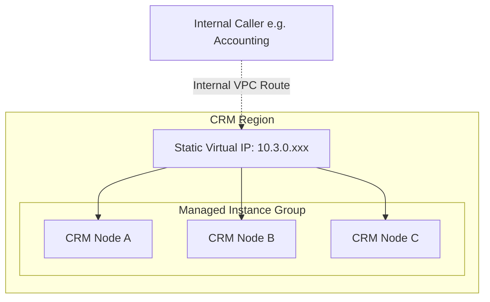

# Internal TCP Load Balancer (ILB)

## What is an Internal Load Balancer?
An Internal TCP/UDP Load Balancer (ILB) is a regional, layer-4 native load balancing framework designed to intercept and seamlessly route restricted traffic propagating safely inside localized GCP VPC interfaces. It universally distributes payload weight optimally, ensuring high availability for internal operational backend deployments without ever routing over public segments.

## How It's Used in This Project
Within our internal operations, structurally monolithic legacy deployments (like the database structure driving **CRM Service** routing logic or the raw analytics nodes hosting the out-of-band **Traffic Collectors**) execute physically without native integration into generalized dynamic Kubernetes orchestrations. 

As a solution, we explicitly organize these independent, isolated Compute Engine runtime configurations into autonomously Managed Instance Groups (MIGs). These groups are placed securely behind a dedicated layer-4 Internal Load Balancer.

Consumers exclusively send requests toward a static internal VIP (Virtual IP Address). The ILB autonomously monitors backend targets, quickly identifying localized unresponsiveness and instantly rerouting active consumer connections to healthy nodes. This effectively leverages optimized Google Cloud Software-Defined Networking without inducing latency-heavy software proxy overhead.

### Architectural Diagram

