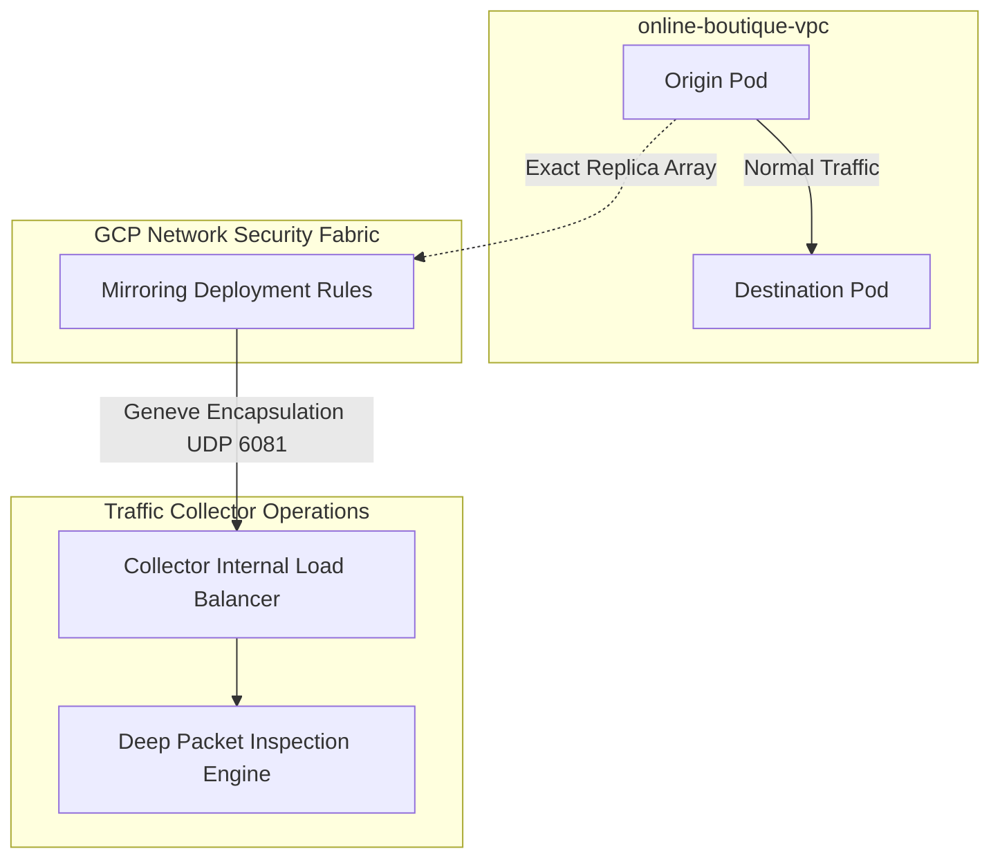

# Out-of-Band Packet Mirroring

## What is Packet Mirroring?
Google Cloud Packet Mirroring creates exact, raw copies of incoming and outgoing network transmission data, mapping it asynchronously towards a specialized endpoint explicitly without causing latency alterations or spanning across the original source communication.

## How It's Used in This Project
To expose insidious application vulnerabilities (e.g. SQL Injections or Cross-Site Scripting payloads recursively propagating through decoupled pod structures without dropping production traffic streams), the system deploys **Deep Packet Inspection (DPI)** securely and completely Out-of-Band (OOB).

As standard client microservice traffic communicates inside the `online-boutique-vpc`, native GCP network configurations duplicate the packet, encapsulate it securely within Geneve protocol (`UDP 6081`) tunneling mechanisms—natively preventing IP alteration dynamically—and route it physically dropping into regional `traffic-collector-vm` ILB groups running pure Python raw socket analyzers completely asynchronously.

### Architectural Diagram

