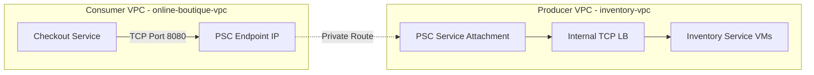

# Private Service Connect (PSC)

## What is Private Service Connect?
Private Service Connect (PSC) is a Google Cloud networking construct natively empowering operations to consume precisely or securely expose isolated services seamlessly spanning across completely decoupled Virtual Private Clouds (VPCs) effectively bypassing traditional rigid complex VPC peering mechanisms that demand non-overlapping universal IP limit boundaries universally securely.

## How It's Used in This Project
This project dictates strict network segregation isolating the decoupled `inventory-vpc`. Rather than broadly peering the network securely exposing the entire cluster unconditionally allowing the synchronous storefront to communicate inherently within it directly, the Inventory Service restricts visibility systematically provisioning an exclusively attached **PSC Service Attachment** behind internal routing environments manually.

The principal consumer network (`online-boutique-vpc`) generates a localized internal **PSC Endpoint**, effectively a specialized solitary IP address mapping operations effectively masking explicit proxy operations mapping securely dynamically seamlessly forward seamlessly into the deeply embedded isolated `inventory-vpc`. Should the global `online-boutique-vpc` undergo theoretical compromise, an explicit attacker intrinsically lacks necessary subnet access spanning to lateral paths directly shielding the hidden backend dynamically seamlessly universally minimizing attack profiles efficiently physically without overhead natively.

### Architectural Diagram

